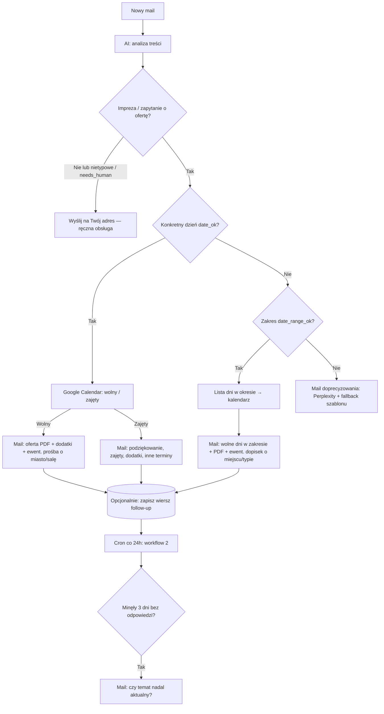

# Jeden mechanizm: mail → impreza? → data → kalendarz → oferta / dopyt / do DJ

Jedna spójna logika dla zapytań o wesela i imprezy (DJ / wodzirej), z możliwością rozbicia na **2 workflowy w n8n** (główny + cron), bo **follow-up po 3 dniach** wymaga pamięci (baza / arkusz).

---

## Diagram decyzji

---

## Pola z AI (jeden JSON z Perplexity)

| Pole | Typ | Znaczenie |
|------|-----|-----------|
| `is_event_inquiry` | boolean | `true` = zapytanie o imprezę / DJ / termin / wycenę; `false` = coś innego (faktura, spam, inna branża). |
| `event_inquiry_confidence` | high / medium / low | Pewność klasyfikacji imprezy. |
| `needs_human_review` | boolean | `true` = nietypowa treść, groźby, prawne, nie da się sensownie obsłużyć auto. |
| `event_date_start` | ISO lub null | Konkretny dzień w **Europe/Warsaw** jeśli da się ustalić. |
| `event_date_end` | ISO lub null | Opcjonalnie. |
| `date_confidence` | high / medium / low | `low` = tylko miesiąc, „lato”, „weekend października” bez dnia. |
| `venue_or_city` | string lub null | Miasto, miejscowość, sala. |
| `location_confidence` | high / medium / low | `low` = brak lub za mało do wyceny dojazdu. |
| `client_name` | string lub null | Jak się zwrócić. |
| `raw_quote` | string | Krótki cytat uzasadniający (logi). |

**Reguły routingu (node Code po parsowaniu):**

1. **`human`** → powiadomienie do Ciebie, gdy: `needs_human_review` **lub** `parse_error` **lub** `!is_event_inquiry` (mail nie jest zapytaniem o imprezę).
2. **`ask_clarification`** → gdy impreza, ale brak `date_ok` **i** brak sensownego `date_range_ok` (albo błąd listy dni w zakresie) → **Code_AskContextForAi** → **Perplexity_AskClarification** → **Code_MergeAskClarification** (JSON `subject` + `html`; przy błędzie API — ten sam szablon co dawniej) → **Resend_AskClarification**. Mail może prosić o datę/okres, miejsce i typ imprezy wg flag.
3. **`calendar` (jeden dzień)** → `date_ok` → **Google Calendar** (*Availability*) → `demo_termin_wolny` → oferta wolny / zajęty. W mailach **wolny/zajęty**, jeśli miejsce nadal niejasne: dodatkowy akapit z prośbą o miasto/salę (bez blokowania wysyłki oferty).
4. **`calendar` (zakres)** → `date_range_ok` → lista **wszystkich dni** w oknie (limit w workflow) → wiele wywołań *Availability* → **jeden mail** z dniami **wolnymi** (z nazwą dnia tygodnia po polsku).

---

## Follow-up po 3 dniach (drugi workflow + magazyn)

Ten sam run n8n **nie pamięta** „wysłałem ofertę 3 dni temu”. Potrzebujesz:

| Element | Opis |
|---------|------|
| **Trigger** | **Schedule** (np. raz dziennie 9:00) lub co kilka godzin. |
| **Magazyn** | **Postgres** (ta sama baza co n8n lub osobna tabela) albo **Google Sheets**: kolumny np. `id`, `client_email`, `sent_at` (timestamp oferty), `followup_sent` (bool), `thread_ref` / `subject`. |
| **Zapis** | Po udanym **Resend_WolnyTermin** (tylko gałąź oferty): **Insert** wiersz z `sent_at = now`, `followup_sent = false`. |
| **Cron workflow** | `SELECT * WHERE followup_sent = false AND sent_at < now() - interval '3 days'` → wyślij krótki mail „Czy temat nadal aktualny?” → `UPDATE followup_sent = true`. |

Unikaj wysyłki follow-upu, jeśli w międzyczasie przyszła odpowiedź od klienta — wtedy potrzebna **aktualizacja rekordu** przy odbiorze maila (IMAP → sprawdź `in-reply-to` / wątek) — to etap zaawansowany; na start wystarczy prostszy cron + ręczne czyszczenie w arkuszu.

---

## Plik workflow w repozytorium

Implementacja kroków **1–4** (follow-up: kolumny w arkuszu + **NoOp_FollowUp3d_SheetHint**; pełna wysyłka = **`automail-followup-2d.json`** — **`N8N_FOLLOWUP_3D_SHEETS.md`**):  
**`n8n-workflows/automail-imap-fixed.json`**

- **Perplexity_Analyze** — rozszerzony prompt (wszystkie pola z tabeli + typ zapytania czasowego).
- **ParseAndRoute** — ustawia `human`, `date_ok`, `date_range_ok`, `location_ok`, kopiuje pola maila.
- **If_Human** → **Resend_NotifyDJ**.
- **If_DateOK** → **true** → **Code_BuildCalWindow** → **If_CalendarRangeOk** → **Google_Calendar_EventsForColorCheck** → **Code_MergeCalendarAvailability** → **PrepareOfertaMails** → **Code_BuildSheetRowZapytania** → równolegle arkusz + **If_SkipClientOfferResend** / **If_TerminWolny** → Resend wolny / zajęty → po **wolnym** terminie: **NoOp_FollowUp3d_SheetHint** (przypomnienie: follow-up z arkusza — patrz **`N8N_FOLLOWUP_3D_SHEETS.md`**). Gdy kalendarz pominięty — gałąź bez Google, i tak **PrepareOfertaMails**. (Kalendarz: **„Cały dzień” + `colorId`** — patrz **`N8N_GOOGLE_CALENDAR_COLOR_BUSY.md`**.)
- **If_DateOK** → **false** → **If_DateRangeOK** → przy zakresie OK: **Code_BuildRangeEventsQuery** → **Google_Calendar_RangeEventsForColor** → **Code_CompactRangeEventsForColor** → **Code_ListSaturdayCalWindows** → **If_RangeSaturdayListOk** → **Code_RollupRangeSaturdays** → arkusz + Resend (mail: **wolne piątki/soboty**; logika kalendarza jak wyżej — **Cały dzień + kolor**); przy braku zakresu / błędzie listy → **Code_AskContextForAi** → …
- **Credentials Perplexity:** przypisz **oba** node’y HTTP: **Perplexity_Analyze** i **Perplexity_AskClarification** (ten sam Header Auth).

---

## Bezpieczeństwo i jakość

- Pierwsze tygodnie: **BCC** swojej skrzynki przy mailach do klienta albo tylko **NotifyDJ** zamiast auto-wysyłki dla części tras.
- **Rate limit** Perplexity / Resend.
- **Lista dozwolonych** `to` w Resend na koncie darmowym.

Powiązane: [`N8N_EMAIL_SETUP.md`](./N8N_EMAIL_SETUP.md), [`N8N_GOOGLE_CALENDAR_ALLDAY_BUSY.md`](./N8N_GOOGLE_CALENDAR_ALLDAY_BUSY.md), [`n8n-workflows/README.md`](./n8n-workflows/README.md).
