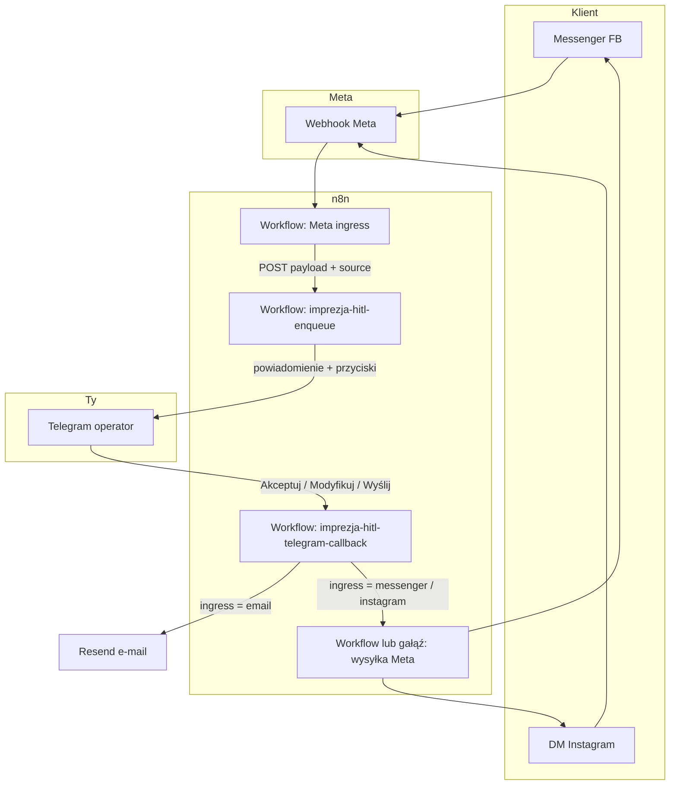
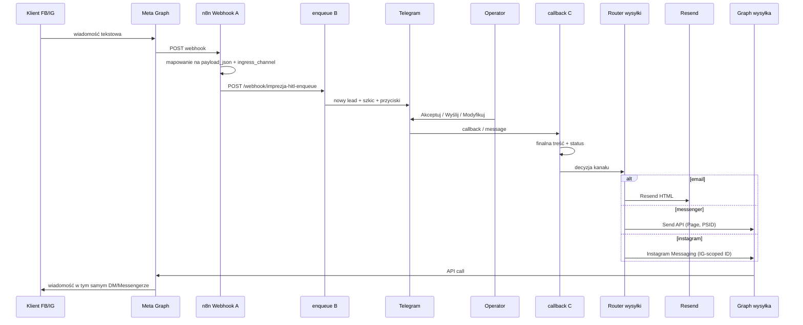

# Schemat: Facebook + Instagram (połączone ze stroną) → HITL Telegram → odpowiedź na tym samym kanale

Dokument **referencyjny** na później — bez wdrożenia w kodzie. Powiązane: [N8N_TELEGRAM_HITL_ZAPYTANIA.md](N8N_TELEGRAM_HITL_ZAPYTANIA.md), [N8N_META_WA_INGRESS_STUB.md](N8N_META_WA_INGRESS_STUB.md), workflowy w [n8n-workflows/](n8n-workflows/).

## Założenia

- **IG Professional** połączone ze **stroną FB** w Meta Business — jedna aplikacja, często **jeden** webhook na zdarzenia messaging.
- **Zasada:** pytanie z **Messengera** → odpowiedź **Messengerem**; pytanie z **DM Instagram** → odpowiedź **Instagramem**. U Ciebie: **jedna** kolejka obsługi i **jeden** pulpit (Telegram), **dwa** sposoby wysyłki do klienta (router po `ingress_channel`).
- **Mail** zostaje jak dziś (Resend). **Meta** nigdy nie przechodzi przez Resend jako „mail do PSID”.

---

## Widok ogólny (proces biznesowy)

---

## Rozbicie na workflowy (logiczne moduły)

| Moduł | Rola | Trigger / wejście |
|--------|------|-------------------|
| **A — Meta ingress** | Weryfikacja webhooka (GET), parsowanie POST, deduplikacja `entry` | Webhook n8n publiczny URL |
| **B — enqueue** (istniejący) | Perplexity, zapis `lead_queue`, Telegram z `ap:` / `rj:` / `md:` | HTTP z modułu A (`Bearer` jak dziś) |
| **C — callback** (istniejący) | Akcje przycisków, dopisek, oferta, Resend dla maila | Telegram |
| **D — egress Meta** (do zbudowania) | Po zatwierdzeniu: `POST` Graph API z **właściwym** `recipient` i kanałem | Wyjście z C, gdy `ingress_channel` ∈ {`messenger`, `instagram`} |

Moduł **D** może być na początku **osobnym workflowiem** wywoływanym przez **Execute Workflow** z końca ścieżki „wyślij do klienta”, albo **dodatkową gałęzią** w tym samym pliku co C — decyzja przy implementacji.

---

## Sekwencja (szczegółowiej)

---

## Pola w `payload_json` (propozycja na przyszłość)

Żeby moduł **D** wiedział, **dokąd** odesłać odpowiedź, zapisz przy imporcie z Meta (moduł **A**):

| Pole | Przykład / znaczenie |
|------|----------------------|
| `ingress_channel` | `messenger` \| `instagram` |
| `external_sender_id` | PSID (FB) lub IG-scoped user id |
| `page_id` | ID strony FB (do tokena strony) |
| `emailSubject` | np. `[IG] Zapytanie od @…` |
| `emailBody` / treść dla AI | tekst od klienta |
| `client_to_email` | puste lub opcjonalnie „prośba o e-mail” w treści |
| `raw_meta_entry` | (opcjonalnie) fragment webhooka do debugu |

Reszta pól jak w ścieżce mailowej (`event_date_start`, `client_name`, …), jeśli uda się wyciągnąć z tekstu przez Perplexity.

---

## Uwagi implementacyjne (skrót)

- **Token:** zwykle **Page Access Token** ze stroną połączoną z IG; dokładne endpointy wysyłki sprawdź w bieżącej dokumentacji Meta dla **Messenger** vs **Instagram Messaging** (mogą różnić się ścieżką lub parametrami).
- **24h okno / zasady konwersacji** — na IG/FB mogą obowiązywać limity jak w Messenger Platform; zaplanuj treść pierwszej odpowiedzi i ewentualne „human handoff”.
- **Idempotencja:** ten sam event webhooka może przyjść wielokrotnie — jak w innych integracjach, rozważ deduplikację po `message.mid` lub odpowiedniku.
- **WhatsApp** — osobny numer i Cloud API; ten sam schemat **A → B → C → D_WA**, ale **D** inny niż FB/IG.

---

## Kolejność wdrożenia (gdy wrócisz do tematu)

1. Moduł **A** + test `POST` ręczny → enqueue z `source: "messenger"` lub `"instagram"`.
2. W Telegramie widać lead z prefiksem `[FB]` / `[IG]` w temacie lub pierwszej linii (tylko UX).
3. Rozszerzyć **C** (lub dodać **D**): gałąź zamiast Resend, gdy `ingress_channel` jest ustawione.
4. Test końcowy: wiadomość z telefonu → akceptacja → odpowiedź **w tym samym** czacie.

---

*Ostatnia aktualizacja: szkic architektury, bez powiązania z konkretnymi ID node’ów w JSON.*
